# ╰┈➤| Lab IV: BluePrints ┆⤿
### *Escuela Colombiana de Ingeniería – Arquitecturas de Software*
### *Autor: Daniel Palacios Moreno*

---

## ╰┈➤ |Requisitos|

- **Java 21**
- **Maven 3.9+**
- **Docker Desktop**

---

## ╰┈➤ |Ejecución del proyecto|

Para ejecutar el proyecto, asegúrate de tener **Docker Desktop instalado y en ejecución**. Luego usa:

```bash
mvn clean install
docker-compose up --build 
```
> Con el comando `docker-compose up --build` corre con el filtro predeterminado el cual es el Identity si quieres  cambiar el filtro agrega al compiezno de este comando $env:SPRING_PROFILES_ACTIVE="nombre del perfil"; por ejemplo `$env:SPRING_PROFILES_ACTIVE="redundancy"; docker compose up --build` lo que activara el filtro del perfil redundancy

> Si deseas activar filtros de puntos (reducción de redundancia, *undersampling*, etc.), implementa nuevas clases que extiendan `BlueprintsFilter` y agrega a la restriccion de perfil de IdentityFilter el nombre del filtro que vayas a usar  crea el perfil en el nuevo filtro 

### Acceso en navegador:

*   **Swagger UI:** <http://localhost:8080/swagger-ui.html>
*   **OpenAPI JSON:** <http://localhost:8080/v3/api-docs>

***

## ╰┈➤ |Estructura de carpetas (arquitectura)|

    src/main/java/edu/eci/arsw/blueprints
      ├── model/         # Entidades de dominio: Blueprint, Point
      ├── persistence/   # Interfaz + repositorios (InMemory, Postgres)
      │    └── old/      # Implementaciones antiguas previas a la migración
      │    └── impl/     # Implementaciones concretas para PostgreSQL
      ├── services/      # Lógica de negocio y orquestación
      ├── filters/       # Filtros de procesamiento (Identity, Redundancy, Undersampling)
      ├── controllers/   # REST Controllers (BlueprintsAPIController)
      └── config/        # Configuración (Swagger/OpenAPI, etc.)

> La estructura sigue el patrón de **capas lógicas**, permitiendo extender el sistema hacia nuevas tecnologías o fuentes de datos.

***

## ╰┈➤ |Actividades del laboratorio|

### 1. Familiarización con el código base

*   Revisión del paquete `model` con las clases `Blueprint` y `Point`.
*   Análisis de la capa `persistence` y su implementación `InMemoryBlueprintPersistence`.
*   Estudio de la capa `services` (`BlueprintsServices`) y del controlador `BlueprintsAPIController`.


El código actual realiza la implementación de una API para gestionar "blueprints", los cuales consisten en puntos en el plano cartesiano, a los cuales se les puede dar un nombre en específico y atribuir a un autor en específico.

Pero, al momento de revisar el código, se puede evidenciar que la persistencia es temporal, por lo que, una vez pasado el tiempo de ejecución de nuestra API, la información se pierde, debido a que únicamente se almacena en un mapa en memoria con valores predefinidos, lo que, al momento de simular el funcionamiento de la API, es perfecto, pero para el cometido de la persistencia, no tanto.

Pero, debido a que el diseño actual del código es altamente extensible, debido al buen uso del polimorfismo y el MVC, la migración hacia una base de datos real, aunque dockerizada, requiere de cambios mínimos, debido a que los contratos de ejecución y de uso ya existen.

***

### 2. Migración a persistencia en PostgreSQL
- Configura una base de datos PostgreSQL (puedes usar Docker).
- Implementa un nuevo repositorio `PostgresBlueprintPersistence` que reemplace la versión en memoria.
- Mantén el contrato de la interfaz `BlueprintPersistence`.

Para poder realizar una migración a PostgreSQL, se decidió utilizar Docker, debido a lo fácil y conveniente que es esta base de datos y su implementación en código. Para realizar la migración, primero se usó el siguiente comando para declarar lo necesario para dockerizar el proyecto y su base de datos:

```bash
docker init
```
Comando con el que se construyeron los archivos base de [Dockerfile](Dockerfile), [compose.yaml](compose.yaml) y [.dockerignore](.dockerignore). Apartir de estos archivos y la configuracion basica que ofrece el docker compose se realizaron cambios para poder crear y correr una base de datos en PostgresSQL, para que la base de datos se pudiera conectar con nuestra API se reservo un puerto para que esta pudiera correr, se uso el puerto *5432* y el servicio se dejo con el puerto que ya venia usando el cual era el *8080*, y dentro de los cambios tambien se agregaron configuracion basicas de seguridad y autenticacion para la base de datos, como tambien la version y volumen que se iba a usar para la creacion de la misma, debido a que esto fue una prueba y no para ningun tipo de produccion no se declararon secrets para las credenciales o constraseñas y se usaron valores por defecto quemados dentro de las mismaas configuraciones.

Una vez configurada y "creada" la base de datos se realizo la implementacion real de la persistencia mediante la clase [PostgresBlueprintPersistence.java](src/main/java/edu/eci/arsw/blueprints/persistence/impl/PostgresBlueprintPersistence.java) usando los contratos ya anteriormente creados por [BlueprintPersistence.java](src/main/java/edu/eci/arsw/blueprints/persistence/impl/BlueprintPersistence.java) la cual reemplaza la anterior version de memoria en ejecucion y para conectar directamente a la base de datos se uso la interfaz [JpaBlueprintRepository.java](src/main/java/edu/eci/arsw/blueprints/persistence/impl/JpaBlueprintRepository.java) que extiende de JpaRepository que tambien se agrego como dependencia del proyecto dentro del pom.xml la cual permite la faciol comunicacion con nuestra base de datos dockerizada.

no se crearon datos por defecto debido a que como la persistencia se mantiene entre ejecuciones, no se vio necesario la insercion de datos en cada construccion de la base de datos.

cabe aclarar que la base de datos esta dockerizada por lo que una vez acabe la ejecucion la Base de datos permanecera activa hasta que se pare la ejecucion del contenedor si esto pasa la informacion si se vera comprometida y borrada.

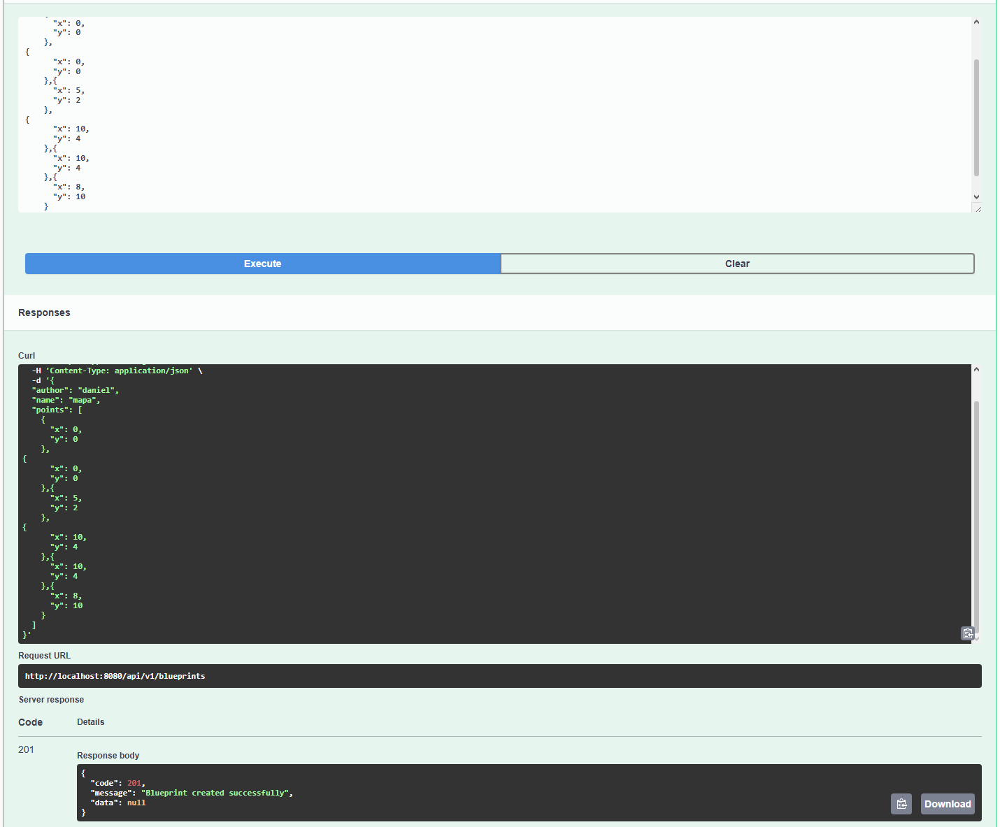

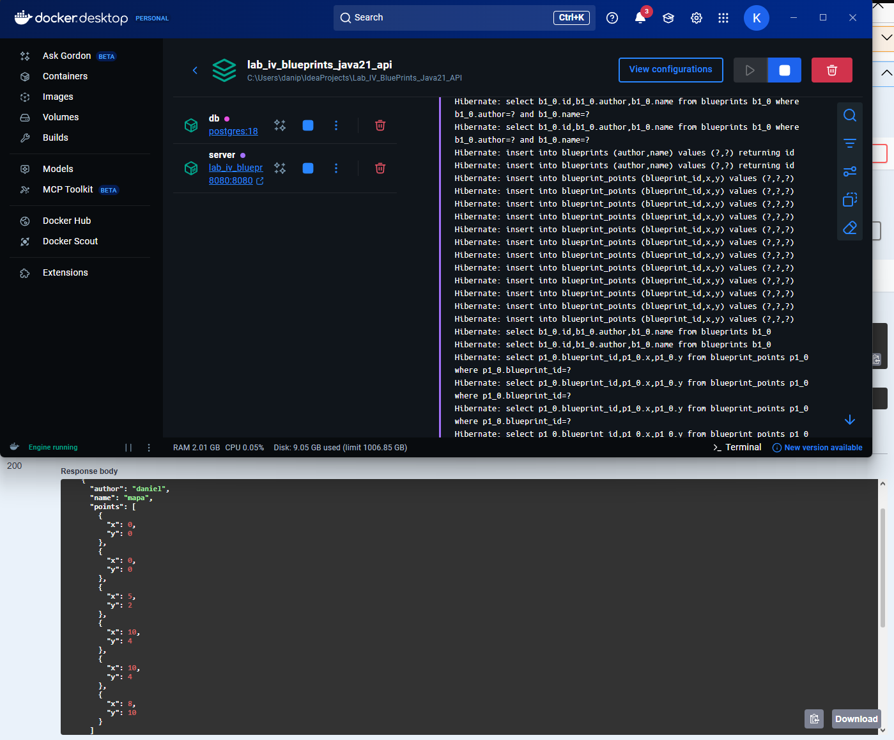
***

### 3. Buenas prácticas de API REST
- Cambia el path base de los controladores a `/api/v1/blueprints`.
- Usa **códigos HTTP** correctos:
    - `200 OK` (consultas exitosas).
    - `201 Created` (creación).
    - `202 Accepted` (actualizaciones).
    - `400 Bad Request` (datos inválidos).
    - `404 Not Found` (recurso inexistente).
- Implementa una clase genérica de respuesta uniforme:
  ```java
  public record ApiResponse<T>(int code, String message, T data) {}
  ```
  Ejemplo JSON:
  ```json
  {
    "code": 200,
    "message": "execute ok",
    "data": { "author": "john", "name": "house", "points": [...] }
  }
  ```
La actualización se realizó desde la anotación `@RequestMapping`, cambiando únicamente el path anterior por el actual, lo que permite que cualquier endpoint generado desde ese controller se pueda comunicar desde ese base path sin generar ningún tipo de conflicto con implementaciones futuras, y permitiendo al proyecto ser más extensible.

Para la implementación de los códigos y de la respuesta uniforme que se nos plantea, se realizó la implementación de una clase llamada `ApiResponseFormated`, que se encarga del manejo y creación de las respuestas con su código HTTP indicado (no se usó el nombre recomendado en la guía debido a que generaba conflictos con una anotación de la documentación que tiene Spring Boot). Se implementaron try-catch para realizar el manejo y control de los errores, para devolver la respuesta correcta según correspondiera, ya sea 400 o 404 para errores, y para cada uno de los endpoints se especificó qué tipo de mensaje de verificación correcta se debía enviar, ya fuera cualquiera de los siguientes: 200, 201, 202.

***

### 4. OpenAPI / Swagger

*   Configuración de `springdoc-openapi`.
*   Documentación accesible en `/swagger-ui.html`.
*   Anotación de endpoints con `@Operation` y `@ApiResponse`.

Para mejorar la documentación, se usaron las anotaciones `@Operation` y `@ApiResponse` que nos brinda Spring Boot para cada endpoint, especificando el path, el método, el código de respuesta y la respuesta esperada. De esta manera, al abrir Swagger o api-docs al momento de querer usar alguno de los endpoints que la API tiene, se cuenta con la documentación adecuada a la mano y el manejo de códigos, lo que permite una mayor facilidad para el uso de la API.

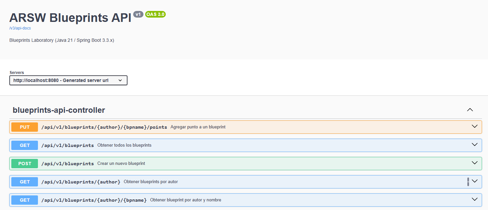

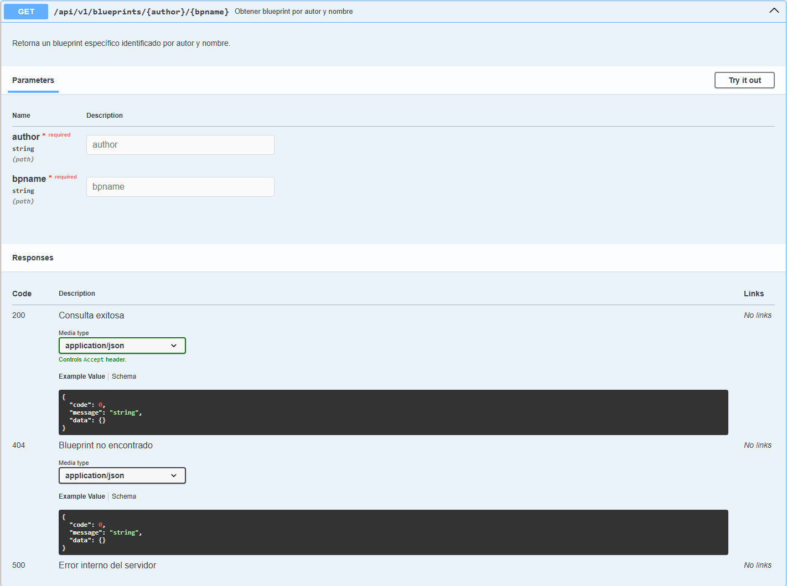

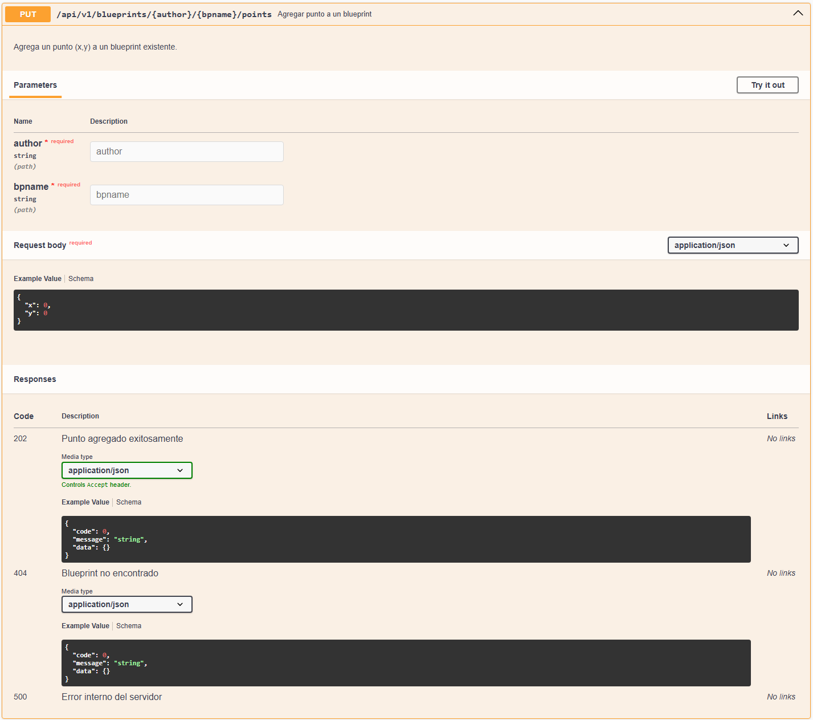

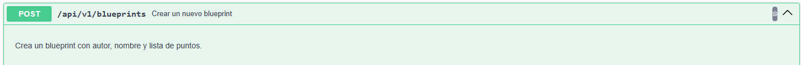

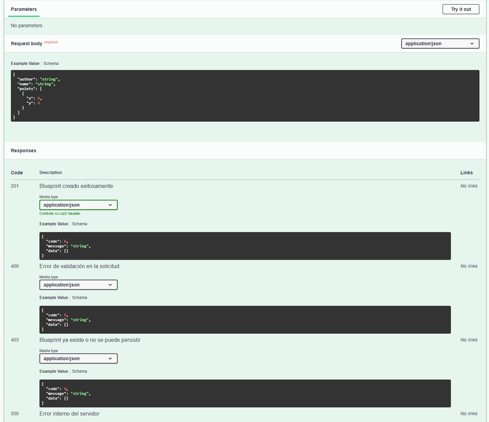

***

### 5. Filtros de *Blueprints*
- Implementa filtros:
    - **RedundancyFilter**: elimina puntos duplicados consecutivos.
    - **UndersamplingFilter**: conserva 1 de cada 2 puntos.
- Activa los filtros mediante perfiles de Spring (`redundancy`, `undersampling`).

Se implementaron los cambios necesarios para que las implementaciones que estaban en el código original de los filtros pudieran usarse y funcionaran correctamente. Primero, se agregó la anotación a [IdentityFilter.java](src/main/java/edu/eci/arsw/blueprints/filters/IdentityFilter.java) de `@Profile("!redundancy && !undersampling")`, la cual, si no se declaraba el uso de ningún filtro, iba a usar este filtro por defecto. Para que al ejecutar el programa se pudieran usar los otros dos filtros existentes, se agregó la línea `SPRING_PROFILES_ACTIVE=${SPRING_PROFILES_ACTIVE:-Identity}` dentro de [compose.yaml](compose.yaml), para así, al momento de construir el contenedor, este pudiera identificar el perfil, como se aclaró en la sección de "Ejecución del proyecto". El comportamiento de los diferentes filtros se puede ver en los siguientes ejemplos:

#### Get original
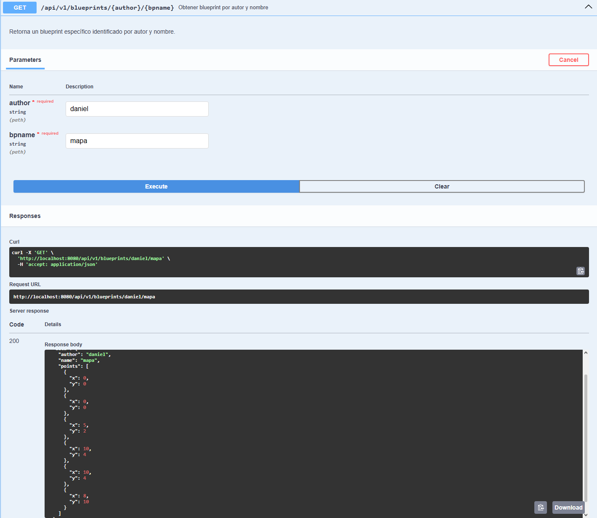

#### Get con filtro **redundancy**

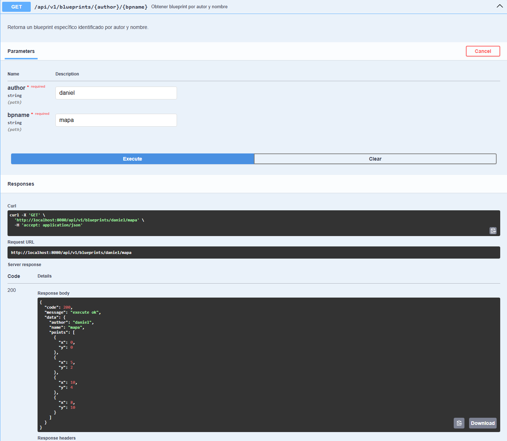

#### Get con filtro **undersampling**

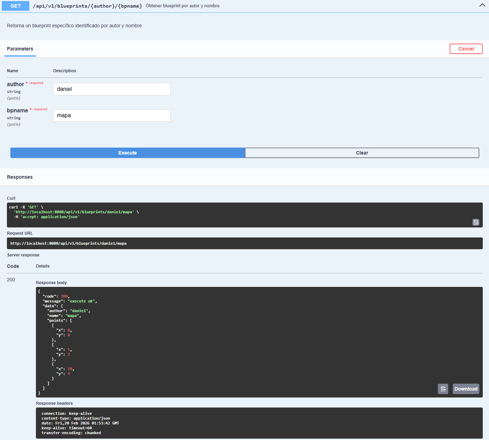

---
## ╰┈➤ |Pruebas de funcionamiento|


### Swagger-ui

[Video evidencia Swagger blueprint.mp4](Images/ReadMe/Video%20evidencia%20Swagger%20blueprint.mp4)

### Docker

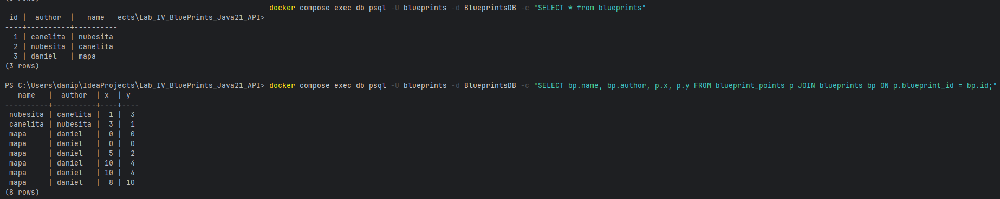

---